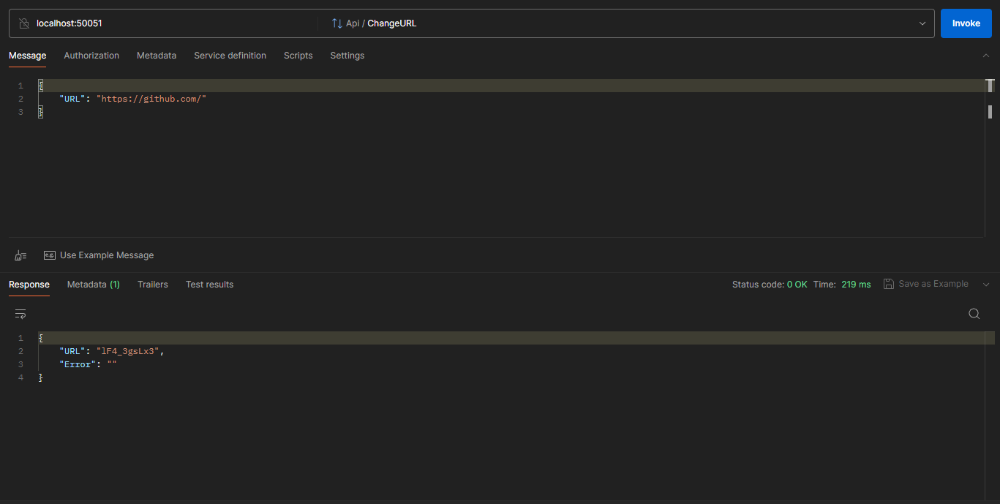
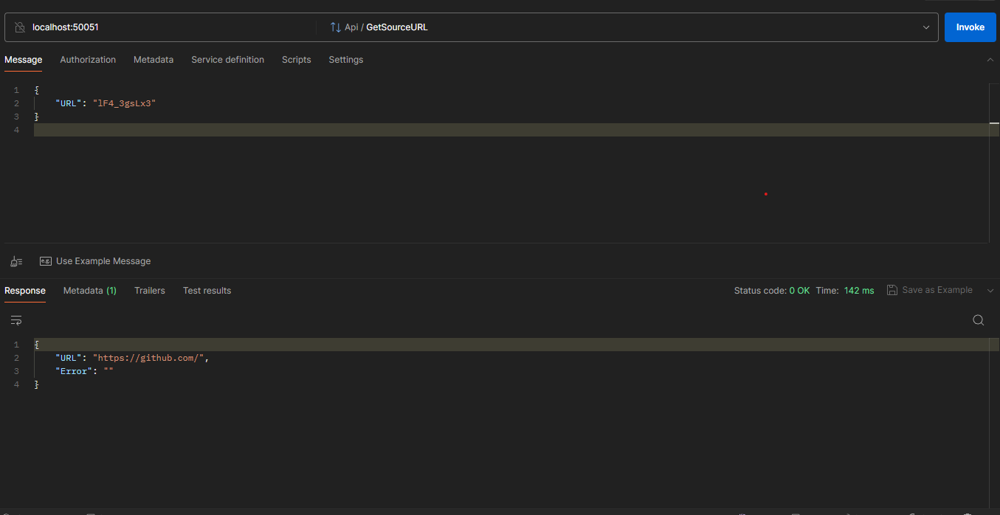

# gRPC Сервер для работы с  URL

Данный gRPC сервер предоставляет два эндпоинта для работы с ссылками. Первый эндпоинт принимает полную ссылку, возвращает
сокращенную ссылку и сохраняет в базу данных(Postgres или In-memory). Второй принимает в качестве аргумента
укороченную ссылку и возвращает полную.

## Установка и Запуск

1. Убедитесь, что у вас установлен Make и Docker.
2. ```git clone https://github.com/maxpurrp/url-processor```
3. Сконфигурируйте базу данных в файле конфига (resourse/config.toml).
4. Запустите сервис следующей командой:

    ```bash
    make all
    ```

Это запустит сервер с настройками базы данных, которые вы указали(дефолтная бд - Postgres)


## Использование

### 1. Эндпоинт для получения укороченной ссылки

Протокол:

```proto
service Api {
   rpc ChangeURL(URLRequest) returns (URLResponse);
}

message URLRequest {
   string URL = 1;
}

message URLResponse {
   string URL = 1;
   string Error = 2;
}
```
Отправьте запрос с помощью Postman или другого приложения для получения укороченной ссылки.
   


### 2. Эндпоинт для получения полной ссылки
```proto
service Api {
   rpc GetSourceURL(URLRequest) returns (URLResponse);
}

message URLRequest {
   string URL = 1;
}

message URLResponse {
   string URL = 1;
   string Error = 2;
}
```
Отправьте запрос с помощью Postman или другого приложения для получения полной ссылки.


### Хранение данных

Данные могут храниться в двух вариантах:

В СУБД PostgreSQL: для использования данной бд предусмотрено конфигурирование через файл resource/config.yaml. В данном файле укажите DB="postgres"

В памяти в виде мапы: для использования данного варианта хранения измените значение переменной DB на "inmemory".

### MakeFile Команды


```make build``` - запустит сборку Docker образа

```make migrations``` - запустит миграции к БД

```make run``` - запустит приложение

```make all``` - запустит по очереди следующие команды:
1. Build
2. Run
3. Migrations

### Тестирование
В папке tests описано 3 вида тестов для 600+ ссылок :
1. 1. Выполнение запроса к серверу с аргументом в виде ссылки для получения укороченной в ответ.
   2. Выполнение запроса к серверу с аргументом в виде укороченной ссылки для получения полной в ответ.
   3. Сравнение исходной полной ссылки с той, которую получили в результате 2 пункта.
2. 1. Выполнение запросов к серверу  для получения всех укороченных ссылок и хранения их в мапе ( map[shortLink]sourceLink )
   2. Выполнение запросов к серверу с укороченными ссылками и получения полной для сравнения с теми, которые хранятся в мапе.
3. Тест на проверку поведения сервера при передаче пустого значения URL.

### Логирование
Используется Zap для логирования работы приложения и отслеживания его состояния


